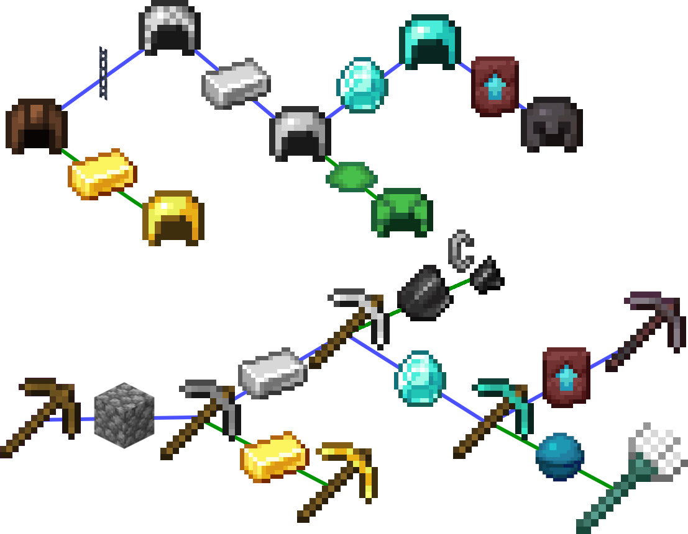

TransmoCrafter Datapack
Copyright (C) 2024 orian34

Version 3.0

> Fully compatible with 1.20.5.

> Upgrading items with custom attribute data will not update values, so I highly recommend using [Item Builder](https://github.com/Zungrysoft/ItemBuilder) or another solution to change attributes like the built-in trim upgrading, to keep the vanilla values upgrade working. (That is, unless you don't want vanilla values and don't want it to change.)

> Check out [this showcase](https://youtu.be/i-Ut_zLyC2o) to give you an idea of what it can do!

# Transmocrafter
Welcome to TransmoCrafter, a datapack that makes the smithing table a true tool for progression.

With it, armor pieces and tools can be upgraded to superior tiers using the corresponding template and tier material. It also allows transmografting, changing the shape of the item by using another piece of the same type(armor or tools) and tier as template. You finally have access to a sweep of engraving runes(trim patterns) for bonus stats on all your gear with sick looks!

What for, you ask? That's because smithing keeps the custom data of the first item, allowing you to shape your gear better to suit your needs, while costing materials. Using this, you have scrolls with specific ranges of gear they can be applied to. Finally you can break down any item using nether stars, which can then be applied to any type of gear.

You can use a costlier version of brewing as well, with ingredients as base (also accepts potions), a potion tier material, and the corresponding template for the potion type. By default, only potions with effect data will give working potions, but you can add any effect data to items to make them work, go wild!

To make it more relevant, the smithing table recipe was changed from requiring iron ingots to any stone type(cobblestone, blackstone, cobbled deepslate). The existing netherite recipes were not changed but a recipe was added to craft the template using 1 netherite ingot, 4 diamonds, and 4 netherrack. Some recipes were disabled for a baseline balance like trim pattern duplication(engraving) or the anvil.

If you only want a feature without another, simply delete/change the files accordingly. Chain blocks had their loot table removed for building comfort, you can readd it as needed.

It has advancements explaining it all in-game for easier playability.

## Tier Material
Each recipe uses a tier material according to the smithing template, there are 10 tiers:
- Wooden = Any Wood Planks
- Leather = Leather
- Stone = Any Cobblestone
- Golden = Gold Ingot
- Chainmail = Chain
- Iron = Iron Ingot
- Diamond = Diamond
- Netherite = Netherite Ingot
- Nether Star = Soul Sand
- Potion = Blaze Powder

## Transmocrafting
- Chain + Leather Armor + Tier Material
- Gold Ingot + Leather Armor + Tier Material
- Iron Ingot + Chainmail Armor + Tier Material
- Diamond + Iron Armor + Tier Material
- Turtle Scute + Iron Helmet + Tier Material
- Netherite Template + Diamond Armor + Tier Material

- Any Cobblestone + Wooden Tools + Tier Material
- Gold Ingot + Stone Tools + Tier Material
- Iron Ingot + Stone Tools + Tier Material
- Diamond + Iron Tools + Tier Material
- Flint + Iron Tools + Tier Material
- Heart of the Sea + Diamond Tools + Tier Material
- Netherite Template + Diamond Tools + Tier Material

- Iron Ingot + Shield + Tier Material
- Iron Ingot + Wheat Seeds + Tier Material

## Engraving
- Any Rune + Any Gear + Any Trim Material

## Transmografting
- Any Tier Tools + Same Tier Tools + Tier Material
- Any Tier Armor + Same Tier Armor + Tier Material
- Bow + Crossbow (vice versa) + Tier Material

## Stardust Forging
- Nether Star + Any Gear + Tier Material
- Any Gear + Nether Star + Tier Material

## Inscribing
- Armor + Flower Scroll + Tier Material
- Tools + Skull Scroll + Tier Material
- Bow/Crossbow + Creeper Scroll + Tier Material
- Shield + Mojang Scroll + Tier Material
- Golden Armor or Tools + Piglin Scroll + Tier Material
- Any Gear + Globe Scroll + Tier Material

## Imbibing
- Nether Wart + Ingredients + Tier Material
- Gunpowder + Ingredients + Tier Material
- Dragon's Breath + Ingredients + Tier Material
